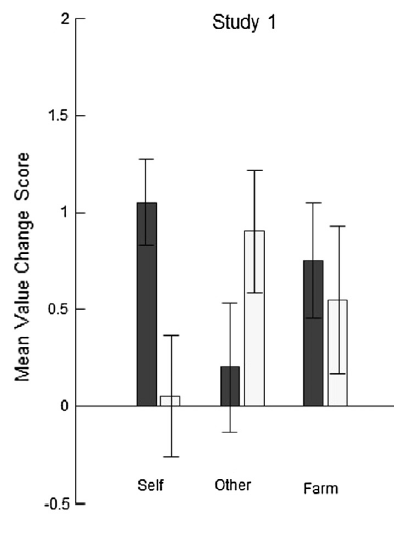

#### Article ID: JcuWB
#### Pilot: Michael Henry Tessler
#### Co-pilot: Roman Feiman
#### Start date: 04/17/2017
#### End date: [Insert end date - use US format]   

-------

#### Methods summary: 
The authors are interested in the "endowment effect" in three-to-four-year-olds. Specifically, they examine the change in subjective valuation (herafter, "value change") of two identical objects which differ in their owner (child vs. experimenter) as a factor of a priming manipulation in which the child has to construct a picture either of themselves (self-focus), a sibling or friend (other-focus) or a neutral picture (adding farm animals to a farm scene).
They predict an interaction of object-owner with the priming manipulation which focuses the child on her/hisself (vs. focusing on others vs. neutral control). When children are given a distractor task (between the two valuations) that makes them focus on themselves (by drawing a picture of themselves), they will display a greater endowement effect.

------

#### Target outcomes: 

Experiment 1 only
Information about the statistical model (Section 2.2.1):

> To examine the effects of priming on value-change for the two identical endowment toys, a mixed ANCOVA was conducted. Toy owner (child or experimenter) was entered as a repeated measures factor and picture type (self-focus, other- focus, neutral-focus) and gender were entered as a between subjects factors. Additionally, child age was normalized and entered as a covariate into the model.

Main results (Section 2.3):

> We found a significant interaction between picture construction condition and toy owner (F(2, 53) = 4.83, p = 0.01, partial eta-squared = 0.15). Specifically, following self-focus, children increased the value of their own toy (M = 0.95, 95% CI = [0.38, 1.52]) but not the experimenter’s toy (M = −0.07, 95% CI = [−0.74, 0.59], t(19) = 3.56, p = 0.01, d = 0.81, Bonferroni corrected). The opposite pattern of responses were observed in the other-focus condition, in which children valued the experimenter’s toy higher (M = 0.86, 95% CI = [0.20, 1.51]), but not their own toy (M = 0.17, 95% CI = [−0.39, 0.73]) - although this effect was not statistically significant (t(19) = −1.61, p = 0.36, d = 0.48, Bonferroni corrected). There was no significant effect of toy owner in the neutral-focus condition (Mchild = 0.89, 95% CIchild = [0.31, 1.46], Mexperimenter = 0.71, 95% CIexperimenter = [0.04, 1.38], t(19) = 0.48, p = 0.64, d = 0.13). The mean value change scores for each condition as a function of toy owner are presented in Fig. 2. We found no significant main effects of types of picture type (Mself = 0.44, 95% CIself = [−0.04, 0.91], Mother = 0.51, 95% CIother = [0.04, 0.98], Mneutral = 0.80, 95% CIneutral = [0.32, 1.28], F(2, 53) = 0.61, p = 0.55, partial eta-squared = .02) or toy owner (Mchild = 0.67, 95% CIchild = [0.34, 0.99], Mexperimenter = 0.50, 95% CIexperimenter = [0.12, 0.89], F(1, 53) = 0.55, p = 0.46, partial eta-squared = .01). A significant effect of age was observed (F(1, 53) = 7.68, p = 0.01, partial eta-squared = .13), indicating that older children increased their valuations more than younger children regardless of toy owner or picture condition. No significant effect of gender (F(1, 53) = 0.46, p = 0.50, partial eta-squared = .01), and no significant interactions involving gender or age were observed (Fs < 2.69, ps > 0.11, etc.).

------

```{r global_options, include=FALSE}
knitr::opts_chunk$set(echo=TRUE, warning=FALSE, message=FALSE)
```

## Step 1: Load packages

```{r}
library(tidyverse) # for data munging
library(knitr) # for kable table formating
library(readxl) # import excel files
library(CODreports) # custom report functions
library(afex) # to run anova
library(lsr) # for cohensD function

to.n <- function(fctr){ # to convert factors to numeric
  return(as.numeric(as.character(fctr)))
}

se <- function(x) sqrt(var(x)/length(x)) # to calculate standard error

m_ci <- function(vector){ # a function to calculate cis of the mean
  df <- length(vector)-1 # degrees of freedom
  E = qt(.975, df)*se(vector) # moe
  xbar = mean(vector)  # sample mean 
  return(xbar + c(-E, E)) # lower and upper cis
}

```

## Step 2: Load data

```{r}
df <- read.csv("data/data.csv")
```

This data frame has 18 variables: 
- participant ID, gender, age, experiment #, prime_type (manipulation), 
- baseline scores for the endowment object(s) (reported in text to be the same for the identical objects for all children), neutral objects, 
- post scores for the endowment object given to the child, experimenter, and for the neutral object
- prime_time is the amount of time spent on the priming / distractor task
- pronouns is number of pronouns of either second person (You, for self-priming) and third person (They, for other priming) in their respective conditions
- change scores (post - baseline)

## Step 3: Tidy data

```{r}
df.tidy <- df %>% filter(study == 1) %>%
  separate(prime_time, into =c('min', 'sec'), sep = "min") %>%
  select(-unowned_post, -unowned_change) %>% # not used in expt 1
  separate(age, into = c("year", "month"), sep = "y") %>%
  mutate(sec = gsub("sec", "", sec),
         sec = as.numeric(sec),
         min = as.numeric(min),
         month = as.numeric(gsub("m", "", month)),
         year = as.numeric(year),
         age_in_months = year*12 + month,
         prime_time_seconds = min*60 + sec,
         neutral_baseline = to.n(neutral_baseline),
         experimenter_post = to.n(experimenter_post),
         child_change = to.n(child_change),
         child_post=to.n(child_post),
         neutral_post = to.n(neutral_post),
         experimenter_change = to.n(experimenter_change),
         neutral_change = to.n(neutral_change),
         child_baseline = endowment_baseline, # since endowment baseline is the same for both what will become the child's and the experimenter's toys, i create new variables representing this
         experimenter_baseline = endowment_baseline) %>%
  select(-endowment_baseline) %>%
  gather(object, response, ends_with("_baseline"), ends_with("_post"), ends_with("_change")) %>%
  separate(object, into = c("object", "scoringPeriod"))
```

Check the "raw" change scores by subtracting baseline from post

```{r}
df.tidy %>%
  spread(scoringPeriod, response) %>%
  mutate(derivedChange = post - baseline,
         diff = change - derivedChange) %>%
  summarize(totalDeviation = sum(diff))
```

The "change" scores reported in the raw data are the same as "post" - "baseline". Good.

## Step 3: Preprocessing

For ANCOVA, age is normalized

```{r}
mean_age = mean(df.tidy$age_in_months)
sd_age = sd(df.tidy$age_in_months)
df.tidy <- df.tidy %>% 
  mutate(age_normalized = (age_in_months - mean_age) / sd_age)
```


## Step 4: Run analysis

### Descriptive statistics

> The mean value change scores for each condition as a function of toy owner are presented in Fig. 2.

```{r descriptives_prime_typeXobject}
df.object.prime_type.summary <- df.tidy %>%
  spread(scoringPeriod, response) %>%
  group_by(object, prime_type) %>%
  summarize(
    sample_mean = mean(change),
    sample_sd = sd(change),
    sample_se = se(change),
    sample_n = n()
  ) %>%
  mutate(
    error = qt(0.975, df = sample_n - 1) * sample_sd / sqrt(sample_n),
    ci_low = sample_mean - error,
    ci_high = sample_mean + error,
    se_low = sample_mean - sample_se,
    se_high = sample_mean + sample_se
  )
```

Figure 2 in paper:



Error bars here denote SEMs. 

Attempt to reproduce Figure 2:

```{r figure2}
df.object.prime_type.summary %>%
  filter(object != "neutral") %>%
  mutate(prime_type = factor(prime_type, levels = c("self", "other", "neutral"),
                             labels = c("self", "other", "farm"))) %>%
  ggplot(., aes( x = prime_type, fill = object, group = object,
                 y = sample_mean, ymin = se_low, ymax = se_high))+
  geom_col(position = position_dodge(0.7), width = 0.7, color = 'black')+
  geom_errorbar(position = position_dodge(0.7), width = 0.5)+
  ylab("Mean Value Change Score")+
  xlab("Picture Focus") +
  ylim(-0.5, 2)
```

Note that this seems to match up pretty well with the results in df.object.prime_type.summary, although the values from which this graph is plotted are never directly reported in the paper, so it's impossible to run CompareValues and check exactly.

```{r descriptives_prime_type}
df.prime_type.summary <- df.tidy %>%
  spread(scoringPeriod, response) %>%
  group_by(prime_type) %>%
  summarize(
    sample_mean = mean(change),
    sample_sd = sd(change),
    sample_n = n()
  ) %>%
  mutate(
    error = qt(0.975, df = sample_n - 1) * sample_sd / sqrt(sample_n),
    ci_low = sample_mean - error,
    ci_high = sample_mean + error
  )

```


### Inferential statistics

> To examine the effects of priming on value-change for the two identical endowment toys, a mixed ANCOVA was conducted. Toy owner (child or experimenter) was entered as a repeated measures factor and picture type (self-focus, other-focus, neutral-focus) and gender were entered as between subjects factors. Additionally, child age was normalized and entered as a covariate into the model.


```{r}
# prepare data for ANCOVA
forAOV <- df.tidy %>%
    filter(scoringPeriod == "change",
           object != "neutral") %>%
    mutate(gender = factor(gender),
           participant_id = factor(participant_id),
           object = factor(object),
           prime_type = factor(prime_type))

# run ANCOVA
aov_out <- aov_ez(id = "participant_id", dv = "response", data = forAOV, between = c("prime_type", "gender"),
within = c("object"), covariate = "age_normalized",
observed = c("age_normalized"), factorize = F, anova_table = list(correction = "none", es = "pes"))

kable(aov_out$anova_table)
```


> We found a significant interaction between picture construction condition and toy owner (F(2, 53) = 4.83, p = 0.01, partial eta-squared = 0.15).

```{r}
# from anova table - prime_type:object -
compareValues(reportedValue = 2, obtainedValue = 2) # df1
compareValues(reportedValue = 53, obtainedValue = 53) # df2
compareValues(reportedValue = 4.83, obtainedValue = 4.8287312) # F
compareValues(reportedValue = .01, obtainedValue = 0.0118449, isP = T) # p
compareValues(reportedValue = .15, obtainedValue = 0.1541311) # partial eta-squared
```
All matches.

> We found no significant main effects of types of picture type (Mself = 0.44, 95% CIself = [−0.04, 0.91], Mother = 0.51, 95% CIother = [0.04, 0.98], Mneutral = 0.80, 95% CIneutral = [0.32, 1.28], F(2, 53) = 0.61, p = 0.55, partial eta-squared = .02) 

```{r}
self <- forAOV %>% filter(prime_type == 'self') %>% pull(response)
other <- forAOV %>% filter(prime_type == 'other') %>% pull(response)
neutral <- forAOV %>% filter(prime_type == 'neutral') %>% pull(response)

self_m <- mean(self)
neutral_m <- mean(neutral)
other_m <- mean(other)

self_ci <- m_ci(self)
neutral_ci <- m_ci(neutral)
other_ci <- m_ci(other)

# descriptives 
compareValues(reportedValue = 0.44, obtainedValue = self_m) # self mean
compareValues(reportedValue = -0.04, obtainedValue = self_ci[1]) # self lower ci
compareValues(reportedValue = 0.91, obtainedValue = self_ci[2]) # self upper ci

compareValues(reportedValue = 0.51, obtainedValue = other_m) # other mean
compareValues(reportedValue = 0.04, obtainedValue = other_ci[1]) # other lower ci
compareValues(reportedValue = 0.98, obtainedValue = other_ci[2]) # other upper ci

compareValues(reportedValue = 0.80, obtainedValue = neutral_m) # neutral mean
compareValues(reportedValue = 0.32, obtainedValue = neutral_ci[1]) # neutral lower ci
compareValues(reportedValue = 1.28, obtainedValue = neutral_ci[2]) # neutral upper ci

# from anova table - prime_type -
compareValues(reportedValue = 2, obtainedValue = 2) # df1
compareValues(reportedValue = 53, obtainedValue = 53) # df2
compareValues(reportedValue = .61, obtainedValue = .5922056) # F
compareValues(reportedValue = .55, obtainedValue = .5567241, isP = T) # p
compareValues(reportedValue = .02, obtainedValue = 0.0218589) # partial eta-squared
```

For ANCOVA -  All matches or minor numerical errors.

But cannot reproduce most of the descriptive statistics.

> or toy owner (Mchild = 0.67, 95% CIchild = [0.34, 0.99], Mexperimenter = 0.50, 95% CIexperimenter = [0.12, 0.89], F(1, 53) = 0.55, p = 0.46, partial eta-squared = .01). 

```{r}
child <- forAOV %>% filter(object == 'child') %>% pull(response)
exp <- forAOV %>% filter(object == 'experimenter') %>% pull(response)

child_m <- mean(child)
exp_m <- mean(exp)

child_ci <- m_ci(child)
exp_ci <- m_ci(exp)


# descriptives 
compareValues(reportedValue = 0.67, obtainedValue = child_m) #  child mean
compareValues(reportedValue = 0.34, obtainedValue = child_ci[1]) # child lower ci
compareValues(reportedValue = 0.99, obtainedValue = child_ci[2]) # child upper ci

compareValues(reportedValue = 0.50, obtainedValue = exp_m) # exp mean
compareValues(reportedValue = 0.12, obtainedValue = exp_ci[1]) # exp lower ci
compareValues(reportedValue = 0.89, obtainedValue = exp_ci[2]) # exp upper ci


# from anova table - object	
compareValues(reportedValue = 1, obtainedValue = 1) # df1
compareValues(reportedValue = 53, obtainedValue = 53) # df2
compareValues(reportedValue = .55, obtainedValue = .5515933) # F
compareValues(reportedValue = .46, obtainedValue = .4309466, isP = T) # p
compareValues(reportedValue = .01, obtainedValue = 0.0103002) # partial eta-squared
```
In this case the there are only matches and minor numerical errors.

> A significant effect of age was observed (F(1, 53) = 7.68, p = 0.01, partial eta-squared = .13), indicating that older children increased their valuations more than younger children regardless of toy owner or picture condition. 

```{r}
compareValues(reportedValue = 1, obtainedValue = 1) # df
compareValues(reportedValue = 53, obtainedValue = 53) # df2
compareValues(reportedValue = 7.68, obtainedValue = 7.3720834) # F
compareValues(reportedValue = 0.01, obtainedValue = 0.0089221, isP = T) # p
compareValues(reportedValue = 0.13, obtainedValue = 0.1221108) # partial eta squared
```
> No significant effect of gender (F(1, 53) = 0.46, p = 0.50, partial eta-squared = .01),

```{r}
compareValues(reportedValue = 1, obtainedValue = 1) # df
compareValues(reportedValue = 53, obtainedValue = 53) # df2
compareValues(reportedValue = 0.46, obtainedValue = 0.4439143) # F
compareValues(reportedValue = 0.50, obtainedValue = 0.5081291, isP = T) # p
compareValues(reportedValue = 0.01, obtainedValue = 0.0083062) # partial eta squared
```

>  and no significant interactions involving gender or age were observed (Fs < 2.69, ps > 0.11, etc.).

```{r}
kable(aov_out$anova_table)
```

Its necessary to eyeball these as the exact values are not reported. The values appear correct.

> Specifically, following self-focus, children increased the value of their own toy (M = 0.95, 95% CI = [0.38, 1.52]) but not the experimenter’s toy (M = −0.07, 95% CI = [−0.74, 0.59], t(19) = 3.56, p = 0.01, d = 0.81, Bonferroni corrected).

```{r}
child <- forAOV %>% filter(prime_type == 'self', object == 'child') %>% pull(response)
experimenter <- forAOV %>% filter(prime_type == 'self', object == 'experimenter') %>% pull(response)
child_m <- mean(child)
exp_m <- mean(experimenter)
child_ci <- m_ci(child)
exp_ci <- m_ci(experimenter)
t_out <- t.test(child, experimenter, paired = T)
p <- p.adjust(p = t_out$p.value, method = 'bonferroni', n = 3)
d <- cohensD(child, experimenter, method = 'pooled')

compareValues(reportedValue = 0.95, obtainedValue = child_m) # mean
compareValues(reportedValue = 0.38, obtainedValue = child_ci[1]) # lower ci
compareValues(reportedValue = 1.52, obtainedValue = child_ci[2]) # upper ci

compareValues(reportedValue = -0.07, obtainedValue = exp_m) # mean
compareValues(reportedValue = -0.74, obtainedValue = exp_ci[1]) # lower ci
compareValues(reportedValue = 0.59, obtainedValue = exp_ci[2]) # upper ci

compareValues(reportedValue = 19, obtainedValue = t_out$parameter[['df']]) # df
compareValues(reportedValue = 3.56, obtainedValue = t_out$statistic) # t
compareValues(reportedValue = .81, obtainedValue = d) # d
compareValues(reportedValue = .01, obtainedValue = p, isP = T) # p 

```
Strangely it seems that we can reproduce the t-test output but not the means and cis.

> The opposite pattern of responses were observed in the other-focus condition, in which children valued the experimenter’s toy higher (M = 0.86, 95% CI = [0.20, 1.51]), but not their own toy (M = 0.17, 95% CI = [−0.39, 0.73]) - although this effect was not statistically significant (t(19) = −1.61, p = 0.36, d = 0.48, Bonferroni corrected).

```{r}
child <- forAOV %>% filter(prime_type == 'other', object == 'child') %>% pull(response)
experimenter <- forAOV %>% filter(prime_type == 'other', object == 'experimenter') %>% pull(response)
child_m <- mean(child)
exp_m <- mean(experimenter)
child_ci <- m_ci(child)
exp_ci <- m_ci(experimenter)
t_out <- t.test(child, experimenter, paired = T)
p <- p.adjust(p = t_out$p.value, method = 'bonferroni', n = 3)
d <- cohensD(child, experimenter, method = 'pooled')

compareValues(reportedValue = 0.17, obtainedValue = child_m) # mean
compareValues(reportedValue = -0.39, obtainedValue = child_ci[1]) # lower ci
compareValues(reportedValue = 0.73, obtainedValue = child_ci[2]) # upper ci

compareValues(reportedValue = 0.86, obtainedValue = exp_m) # mean
compareValues(reportedValue = 0.20, obtainedValue = exp_ci[1]) # lower ci
compareValues(reportedValue = 1.51, obtainedValue = exp_ci[2]) # upper ci

compareValues(reportedValue = 19, obtainedValue = t_out$parameter[['df']]) # df
compareValues(reportedValue = -1.61, obtainedValue = t_out$statistic) # t
compareValues(reportedValue = .48, obtainedValue = d) # d

compareValues(reportedValue = .36, obtainedValue = p, isP = T) # p 
```

Again it seems that we can reproduce the t-test output but not all of the means and cis.

> There was no significant effect of toy owner in the neutral-focus condition (Mchild = 0.89, 95% CIchild = [0.31, 1.46], Mexperimenter = 0.71, 95% CIexperimenter = [0.04, 1.38], t(19) = 0.48, p = 0.64, d = 0.13).

```{r}
child <- forAOV %>% filter(prime_type == 'neutral', object == 'child') %>% pull(response)
experimenter <- forAOV %>% filter(prime_type == 'neutral', object == 'experimenter') %>% pull(response)
child_m <- mean(child)
exp_m <- mean(experimenter)
child_ci <- m_ci(child)
exp_ci <- m_ci(experimenter)
t_out <- t.test(child, experimenter, paired = T)
d <- cohensD(child, experimenter, method = 'pooled')

compareValues(reportedValue = 0.89, obtainedValue = child_m) # mean
compareValues(reportedValue = 0.31, obtainedValue = child_ci[1]) # lower ci
compareValues(reportedValue = 1.46, obtainedValue = child_ci[2]) # upper ci

compareValues(reportedValue = 0.71, obtainedValue = exp_m) # mean
compareValues(reportedValue = 0.04, obtainedValue = exp_ci[1]) # lower ci
compareValues(reportedValue = 1.38, obtainedValue = exp_ci[2]) # upper ci

compareValues(reportedValue = 19, obtainedValue = t_out$parameter[['df']]) # df
compareValues(reportedValue = 0.48, obtainedValue = t_out$statistic) # t
compareValues(reportedValue = .13, obtainedValue = d) # d

compareValues(reportedValue = .64, obtainedValue = t_out$p.value, isP = T) # p 
```


## Step 5: Conclusion

```{r}
codReport(Report_Type = 'joint',
          Article_ID = 'JcuWB', 
          Insufficient_Information_Errors = 0,
          Decision_Errors = 0, 
          Major_Numerical_Errors = 18, 
          Minor_Numerical_Errors = 6,
          Author_Assistance = F)
```

```{r session_info, include=TRUE, echo=TRUE, results='markup'}
devtools::session_info()
```
